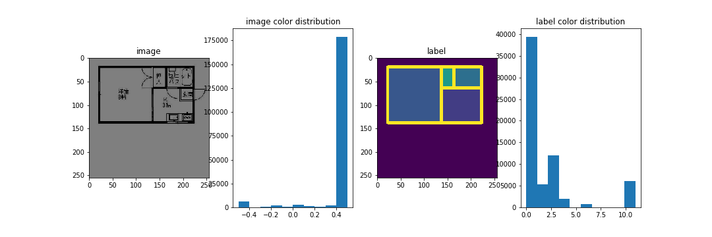
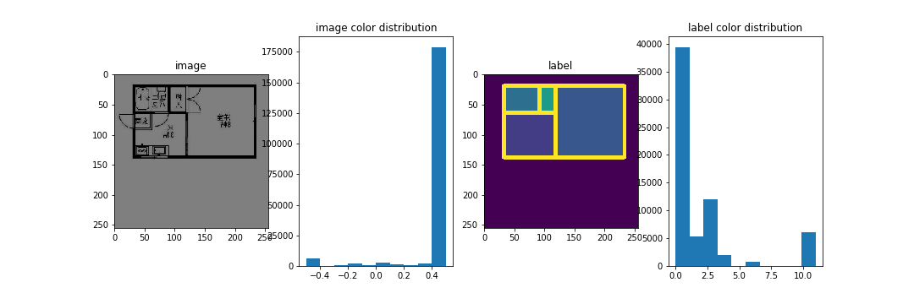
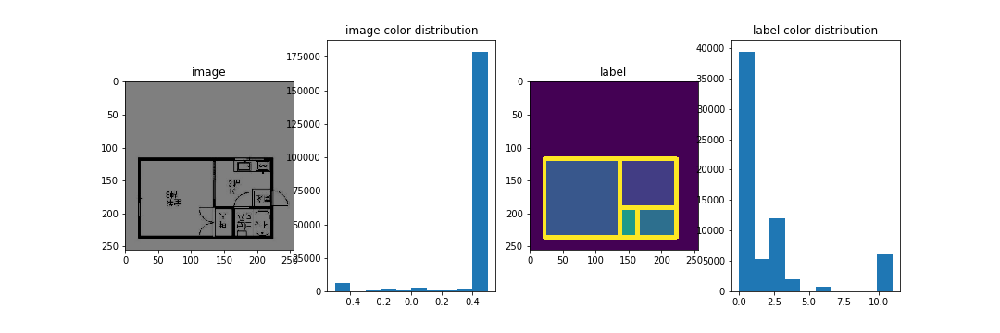
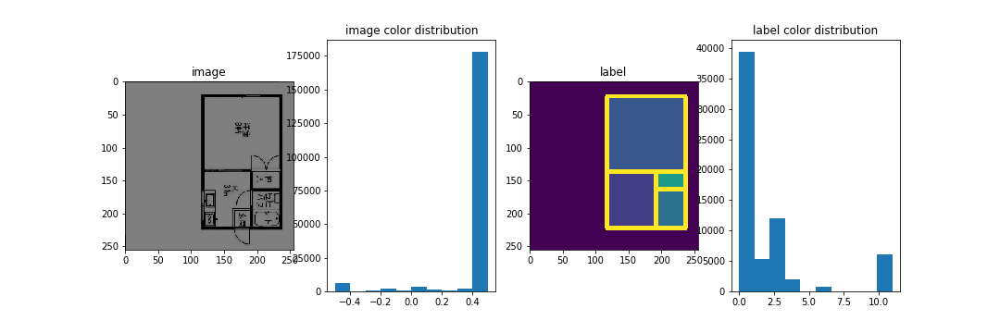
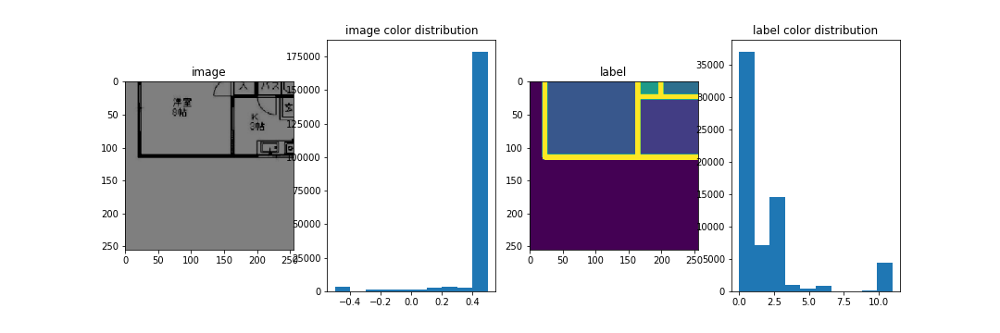

# pair_augment
image and label pair augmentation for computer vision projects

## problems of data augmentation
In semantic segmentation, image-label pairs should be augmented equally. Sometimes, data augmentation fails due to the following issues:
- Augmented data is out of domain. (for logos etc.)
- Distribution of augmented data is different. (for dtype conversion etc.)

In order to deal with above questions, we tried to augment data in numpy format, ranther than convert it to PIL.Image etc. It can be seamlessly comprised in your project before converted to other tensor types like pytorch etc.

## compare train/valid loss curve to check overfitting
If data augmentation succeeds, the valid loss curve will converge to train loss curve, otherwise they will fall apart at early stage of training.

## example images
Image and label data type and distribution do not change before and after augmentation.
- original

- h-flip

- v-flip

- random rotation

- scale crop

## reference
https://github.com/xkumiyu/numpy-data-augmentation
